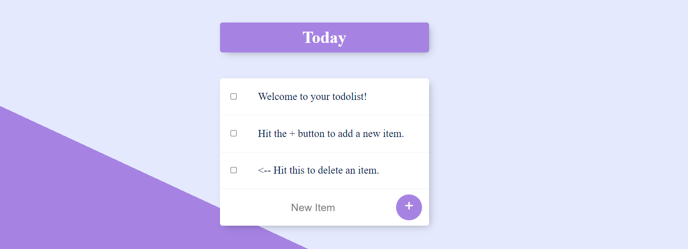
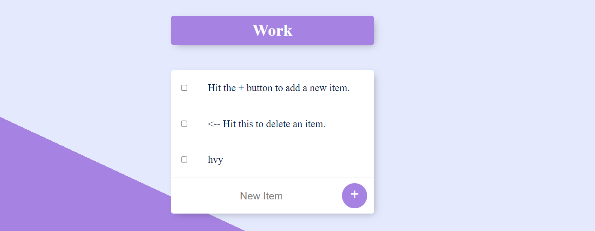
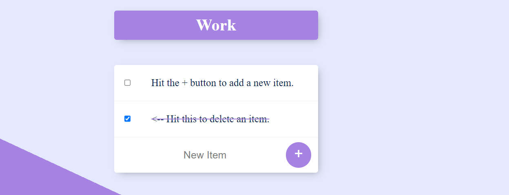

<h1 align="center">TODO LIST</h1>

## 🤔 What is Todo List?

It's a list of tasks you need to complete or things that you want to do. After completion of tasks you can simply remove it from list.

## ❓ About the Game

This TodoList is a online version of the list was built with [MongoDB](https://www.mongodb.com/), [Express](https://expressjs.com/) and [Node](https://nodejs.org/en/). It completely saves your tasks in database and then if you delete them it also remove from database.

## 🧐 How to Add\Remove?

1. Once you're on the homepage/workPage of the list, you can simply click on + button to add task and click on checkbox to remove that task.
2. That's it! Set your daily/weekly goals and achieve them. Be Motivated!

## 🎮 Screenshots

